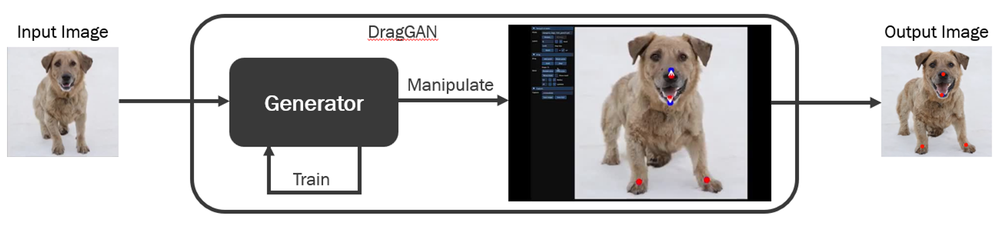

  <h1 align="center">Drag Your GAN with Addaptive GAN</h1>
  <h2 align="center">All rights reserved to the original Drag Your GAN work</h2>
  

    <a href="https://arxiv.org/abs/2305.10973/"><strong>Paper link</strong></a>
    ·
    <a href="https://github.com/XingangPan/DragGAN/"><strong>Code link</strong></a>
    ·
    <a href="https://vcai.mpi-inf.mpg.de/projects/DragGAN/"><strong>Project link</strong></a>
  

  

    <a href="https://xingangpan.github.io/"><strong>Xingang Pan</strong></a>
    ·
    <a href="https://ayushtewari.com/"><strong>Ayush Tewari</strong></a>
    ·
    <a href="https://people.mpi-inf.mpg.de/~tleimkue/"><strong>Thomas Leimkühler</strong></a>
    ·
    <a href="https://lingjie0206.github.io/"><strong>Lingjie Liu</strong></a>
    ·
    <a href="https://www.meka.page/"><strong>Abhimitra Meka</strong></a>
    ·
    <a href="http://www.mpi-inf.mpg.de/~theobalt/"><strong>Christian Theobalt</strong></a>
  

  <h3 align="center">SIGGRAPH 2023 Conference Proceedings</h3>
  

    
  

  

   
    
    
    
    
    
  

## Problem

When using the tool, can notice that the object may loss its essential characteristics during the iterations. 
For example, when rotating a car, it can end up with a different model than the original car model in the first iteration. 
Another example, when moving a person arm, it caused her hair to turn blonde.

  
  

## Solution

The soultion found for this problem is to use method based on Adaptive GAN (by Shady Abu Hussein). With this method, the generator trained on the input image before running the manipulation. After a few iterations of training the happens only once per image, can work with the tool as usual.

<a href="https://arxiv.org/pdf/1906.05284.pdf/"><strong>Paper link</strong></a>
·
<a href="https://github.com/shadyabh/IAGAN/"><strong>Code link</strong></a>
·
    

  

## Results

With the results we can see a minor improvement of the problem, and see that the main characteristics were preserved a little better. Adjusting the weights of the generator may potentially induce artifacts or distortions in the resulting images.
Need to fine tuning the training hyperparameters per class.

  

## How to Run

   
    

* Click on the Google Colab Link.
* Connect to GPU (T4).
* Run all lines.
* Open the Gradio Application link.
* Start to play with the tool :).
* You can change number of iterations or/and learning rate at "viz/renderer.py" lines 269 & 272.
